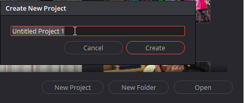
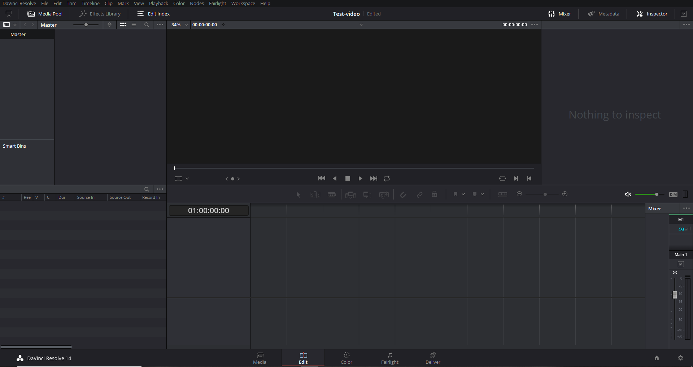
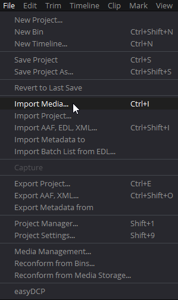
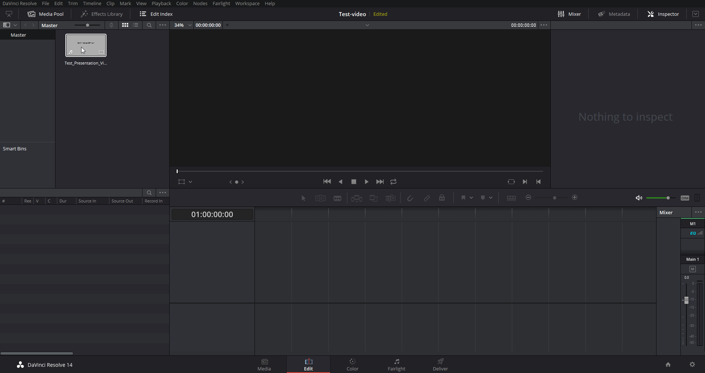
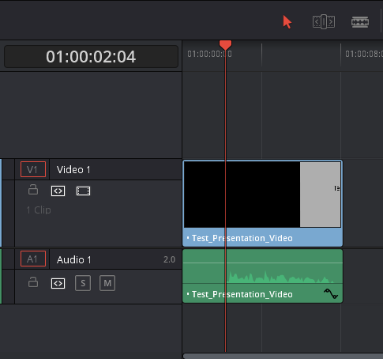
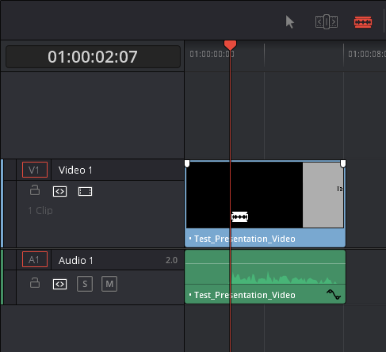
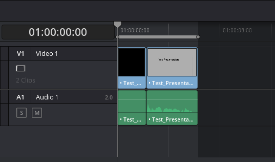
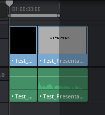
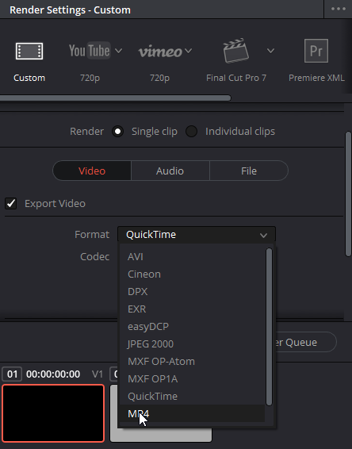
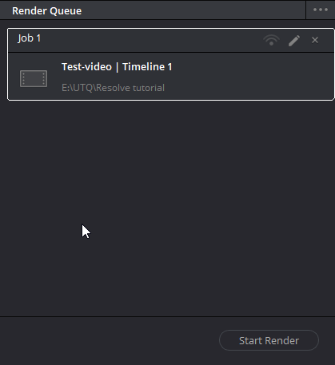

# Using Davinci Resolve to Edit a Recorded Lecture

Davinci Resolve is a video editing software developed by Black Magic Design with a lot of functionality. There is a free version that you can download and start using right away. To download the software, visit the [Davinci Resolve website](https://www.blackmagicdesign.com/nl/products/davinciresolve/).

### Create a new project
Open Davinci Resolve. Your "Projects" folder will open. On the bottom right corner, click "New Project". The "Create New Project" window will appear. Name your project, and click "Create".

You will open a blank workspace.

Import your video by either dragging and dropping the file in the media pool or clicking File -> Import Media and choosing the file you wish to import. Note that Davinci Resolve does not support all file types, so you may need to convert your video first.

To start working on your video, you can drag it from the media pool to the editing workspace.

In the editing workspace, you can see the video (top) and audio (bottom) channel. 

If you want to cut a piece from the video, click your cursor to the time that you want to start cutting. Click on the "Razor Edit Mode" Tool.

Then click on the workspace next to the cursor.

This will cut your video. Then move your cursor to the time on the video where you wish to stop the cut and repeat the previous step. Then switch your cursor from Razor Editing Mode to Selection Mode.Click on the region you wish to delete.

Click Delete. If you are happy with the way your video has come together, you can export it. At the bottom of the workspace, click "Deliver"

The video editing workspace will appear with gray bounds.

You can change the bounds of the video render by moving the edges of the gray area

On the left side of the screen, you can choose your render settings. Decide which file type you want.

Then click "Add to Render Queue". This will prompt you to choose a path for your file. Once you have chosen the path, your file will appear in the render queue. 

Click on "Start Render". Davinci Resolve will render your video, and it will be ready for use.
